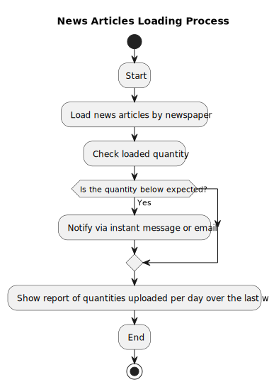

# News API Project

This is a Python-based News API project that allows you to fetch news articles by newspaper. The application monitors the quantity of articles loaded and notifies via instant message or email if the number is below the expected average, based on historical data from the last 6 months for the same day of the week. Additionally, it provides a report of the quantities uploaded daily over the past week.



## Prerequisites

- Python 3.x
- pip (Python package manager)

## Setup

To set up the project, follow the steps below to create and activate a virtual environment and install the dependencies.

### 1. Create a Virtual Environment

#### Linux / macOS

```bash
python3 -m venv venv
```

#### Windows

```bash
python -m venv venv
```

### 2. Activate the Virtual Environment

#### Linux / macOS

```bash
source venv/bin/activate
```

#### Windows

```bash
venv\Scripts\activate
```

### 3. Install Dependencies

Once the virtual environment is activated, install the project dependencies using `pip`.

```bash
pip install -r requirements.txt
```

### 4. Run the Application

#### Linux / macOS

```bash
python3 -m app.main
```

#### Windows

```bash
py -m app.main
```

This will start the application.
